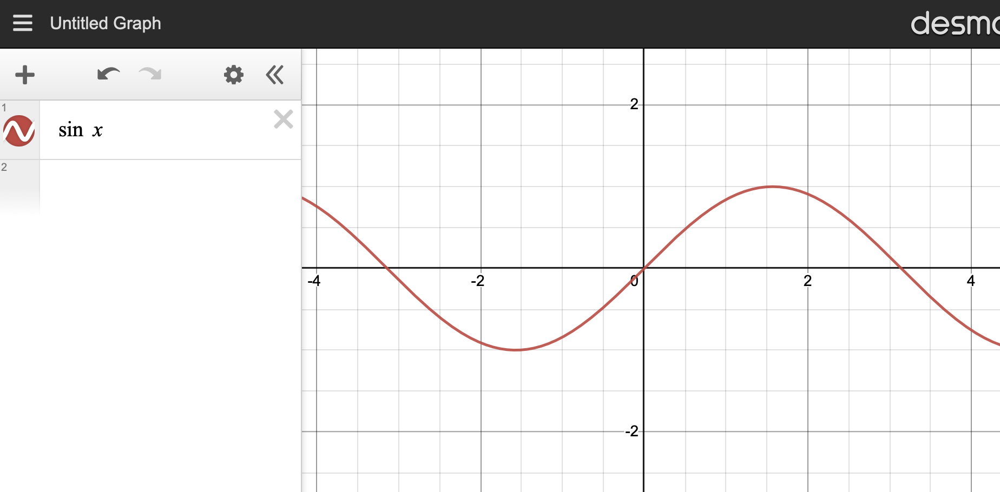
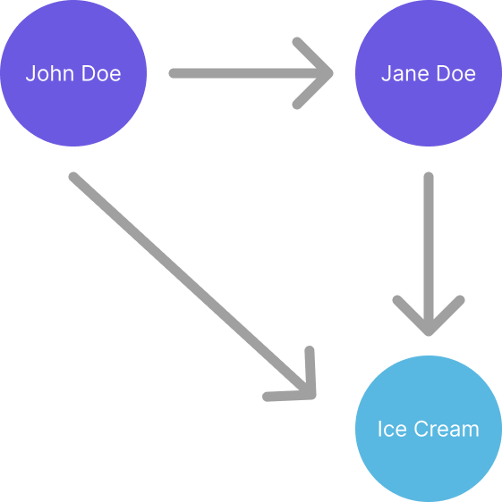
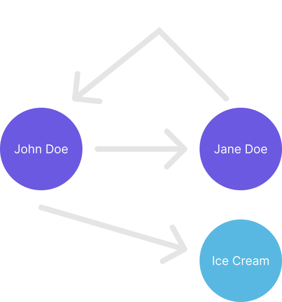

---

title: Using MongoDB as a graphDB
theme: night

---

# Hi

Is this working?

---

## Let's talk about graphs

---

## No, not that kind 

In computer science when we say Graph we mean dots and dashes

.... . .-.. .-.. --- / .-- --- .-. .-.. -..

Oh, wait that's the morse code. Let's try this again, shall we?

---

## This is a Graph (in CS)

----

---

## Dots and Arrows

What is a Graph?

- In mathematics, a Graph is a set of vertices and edges.
- That's fancy speak for dots and arrows.
- We have dots representing a "thing" and arrows that show how one thing is
related to another. 
- In the world of mathematics, Jane Doe is still related to John Doe even if
they broke up - she now has a "hates" relation with John Doe.

---

## Why should you care?

> Spoiler alert: You shouldn't. It's not worth it. Leave while you can.
We're going into a rabbit hole.

----

### JK, Graphs make "some" things easier

Let's take a look at a few examples.
